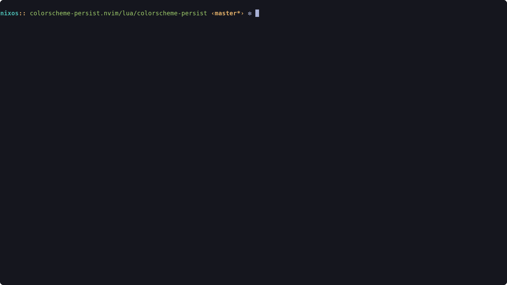

# 📄 colorscheme-persist

Like `:Telescope colorscheme` but saving the selection to a file so the
colorscheme can persist the next time you open neovim. Without having to
manually modify your config files.




# 📦 Installation

Use your favorite package manager.

### [lazy.nvim](https://github.com/folke/lazy.nvim)

```lua
{
  "propet/colorscheme-persist.nvim",
  lazy = false, -- load immediately to set the colorscheme on startup
  dependencies = {
    "nvim-telescope/telescope.nvim",
    -- Add your colorscheme plugins here, e.g.:
    "Th3Whit3Wolf/space-nvim",
    "luisiacc/gruvbox-baby",
    "folke/tokyonight.nvim",
    "rebelot/kanagawa.nvim",
  },
  keys = {
    {
      "<leader>sc", -- Or your preferred keymap
      function()
        require("colorscheme-persist").picker()
      end,
      mode = "n",
      desc = "Choose colorscheme",
    },
  },
  opts = {
    -- Absolute path to file where colorscheme should be saved
    -- Default: file_path: vim.fn.stdpath("data") .. "/.nvim.colorscheme-persist.lua",
    -- file_path = vim.fn.stdpath("config") .. "/colorscheme.lua",

    -- In case there's no saved colorscheme yet
    -- Default: fallback: "blue",
    -- fallback = "quiet",

    -- List of ugly colorschemes to avoid in the selection window
    -- Default:
    --   disable = {
    --     "darkblue", "default", "delek", "desert", "elflord", "evening",
    --     "industry", "koehler", "morning", "murphy", "pablo", "peachpuff",
    --     "ron", "shine", "slate", "torte", "zellner"
    --   },
    -- disable = { "darkblue" },

    -- Options for the telescope picker
    -- Default: picker_opts = require("telescope.themes").get_dropdown()
    -- picker_opts = require("telescope.themes").get_ivy(),
  },
}
```

**Note:** Colorschemes need to be installed separately.
Add them to your package manager configuration.
The `dependencies` key in the example above is optional if you manage your colorscheme plugins elsewhere.


# 🚀 Usage

The plugin automatically loads the saved colorscheme on startup when configured as shown in the `lazy.nvim` example (`lazy = false`).

Use the configured keymap (e.g., `<leader>sc`) to open the Telescope picker,
select a colorscheme,
and it will be automatically saved and applied for future sessions.
```
